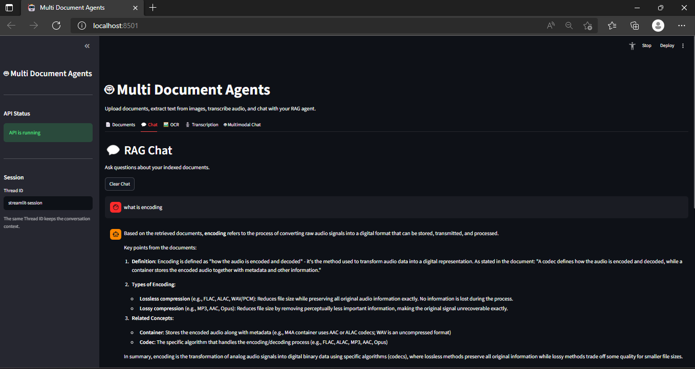

# 🤖 Multi Document Agents

[](https://www.python.org/)
[](https://fastapi.tiangolo.com/)
[](https://streamlit.io/)
[](https://www.langchain.com/)
[](https://www.langchain.com/langgraph)
[](https://smith.langchain.com/)
[](https://openai.com/)
[](https://openrouter.ai/)
[](https://github.com/openai/whisper)
[](https://github.com/JaidedAI/EasyOCR)
[](https://conda.io/)
[](https://docs.astral.sh/ruff/)
[](#license)

A multi-agent Retrieval-Augmented Generation (RAG) system that lets you chat with your documents through three specialized AI agents working together — instead of relying on a single model to do everything. The system also supports **OCR** (image-to-text) and **Voice Transcription** (speech-to-text) as additional input modalities, so you can ask questions using text, images, or audio.

Built with **FastAPI** (backend), **Streamlit** (UI), **LangGraph** (agent orchestration), and **LangSmith** (monitoring).

---

## 🎬 Demo

<!-- Replace the path below with your actual screenshot/GIF, e.g. assets/demo.png or assets/demo.gif -->


---

## ✨ Features

- 📄 **Multi-format document ingestion** — PDF, TXT, MD, PY, YAML, JSON, CSV, DOCX, PPTX
- 🔍 **3-agent RAG workflow** — Retriever, Analyst, and Answer agents coordinated by an Orchestrator
- 🖼️ **OCR** — extract text from images (PNG, JPG, JPEG, WEBP)
- 🎙️ **Voice transcription** — transcribe audio (WAV, MP3, M4A, FLAC, OGG) in Arabic or English via Whisper
- 🧠 **Multimodal chat** — combine text queries with OCR and transcription context
- 🗂️ **Vector database** — fast, precise semantic search over chunked & embedded documents
- 📊 **LangSmith monitoring** — trace and debug agent runs
- 🎨 **Streamlit UI** — tabs for document upload, chat, OCR, transcription, and multimodal chat
- ⚡ **FastAPI backend** — clean REST API powering the UI (and usable independently)

---

## 🏗️ Architecture

### 1. Document Preparation Pipeline

Before the agents start working, uploaded files go through an automatic ingestion pipeline:

1. **Cleaner** — cleans up raw text
2. **Chunker** — breaks text into smaller, readable chunks
3. **Embedder** — converts chunks into embeddings (searchable numerical vectors)
4. **Vector Store** — stores embeddings in a vector database for fast retrieval

### 2. The 3-Agent Workflow

When a question is asked, an **Orchestrator** (built with LangGraph) coordinates three dedicated agents:

#### 🔎 Retriever Agent
Finds relevant evidence from the vector database. It does **not** attempt to answer the question — its only job is retrieval. Its system prompt lives in `src/config/prompts/retriever.py`.

| Tool | Purpose |
|---|---|
| **Query Rewriter** | Rewrites vague, conversational, or context-dependent questions into clear, retrieval-friendly queries (resolves pronouns, expands abbreviations, generates alternative phrasings) |
| **Semantic Search** | Embeds the query and compares it against stored document vectors using cosine similarity to find meaning-based matches |
| **Keyword Search** | Lexical/exact-term matching (e.g. BM25, inverted indexes) — ideal for technical terms, IDs, names, and equations |
| **Metadata Filter** | Restricts retrieval by document name, page, chapter, author, date, or type |
| **Reranker** | Re-scores and reorders initial candidate chunks (e.g. top 20–50) for higher relevance |
| **Context Selector** | Selects a compact, diverse, high-quality subset of chunks (e.g. best 5–8) to hand off to the Analyst, preserving citation metadata |

#### 🧮 Analyst Agent
Takes the evidence gathered by the Retriever and does the heavy lifting: evaluating, comparing, extracting, and calculating. If it finds the evidence insufficient, it triggers a **feedback loop** back to the Retriever for more information. Its system prompt lives in `src/config/prompts/analyst.py`.

| Tool | Purpose |
|---|---|
| **Calculator** | Performs accurate numeric operations (sums, averages, percentages, ratios, statistics) instead of relying on the LLM's internal math |
| **Table Extractor** | Extracts structured tables (e.g. model performance metrics) from documents into rows/columns for analysis |
| **Document Comparison** | Compares information across multiple documents — advantages, disadvantages, methods, results |
| **Data Analysis** | Performs structured analysis over numerical/tabular data — averages, rankings, trends, distributions |
| **Search / Retrieve More Evidence** | Sends a follow-up query back to the Retriever when evidence is incomplete, forming a feedback loop |

#### ✍️ Answer Agent
Once the Analyst confirms there is sufficient evidence, this agent crafts the final response — organizing insights into clear text or tables and attaching precise document and page citations.

---

## 📁 Project Structure

```
.
├── src/
│   ├── agents/
│   │   ├── retriever.py
│   │   ├── analyst.py
│   │   └── answer.py
│   ├── graph/
│   │   ├── nodes.py
│   │   ├── edges.py
│   │   ├── state.py
│   │   └── workflow.py
│   ├── ingestion/
│   │   ├── cleaner.py
│   │   ├── chunker.py
│   │   ├── embedder.py
│   │   ├── loader.py
│   │   └── pipeline.py
│   ├── retrieval/
│   │   ├── semantic_search.py
│   │   ├── keyword_search.py
│   │   ├── hybrid_search.py
│   │   ├── metadata_filter.py
│   │   ├── reranker.py
│   │   ├── context_selector.py
        ├── query_rewriter.py
│   │   └── vector_store.py
│   ├── tools/
│   │   ├── calculator.py
│   │   ├── table_extractor.py
│   │   ├── document_comparator.py
        ├── search_evidence.py
│   │   └── data_analysis.py
│   ├── additional_features_task2/
│   │   ├── ocr/
│   │   │   └── ocr_feature.py
│   │   └── voice/
│   │       └── voice_feature.py
│   ├── backend/
│   │   └── main.py          # FastAPI app
│   ├── ui/
│   │   └── app.py           # Streamlit app
│   └── config/
│       ├── settings.py
│       └── prompts/
│           ├── retriever.py
│           └── analyst.py
├── tests/
│   └── retrieval/
│       └── test_retrieval_quality.py
├── Makefile
├── requirements.txt
└── README.md
```

---

## 🚀 Getting Started

### Prerequisites

- Python 3.12
- [Conda](https://docs.conda.io/) (recommended for environment management)
- An OpenAI (or OpenRouter-compatible) API key
- A LangSmith API key (optional, for monitoring)

### 1. Create and activate the environment

```bash
make create
conda activate docu-agents
```

### 2. Install dependencies

```bash
make install
```

### 3. Configure environment variables

Create a `.env` file in the project root:

```env
OPENROUTER_API_KEY=your_openrouter_api_key
COMPARATOR_API_KEY=your_comparator_agent_api_key
ANALYST_API_KEY=your_analyst_agent_api_key
LANGSMITH_TRACING=true
LANGSMITH_API_KEY=your_langsmith_api_key
LANGSMITH_PROJECT=multi_doc_agents
```

### 4. Run the backend (FastAPI)

```bash
make backend
```

The API will be available at `http://127.0.0.1:8000`, with interactive docs at `http://127.0.0.1:8000/docs`.

### 5. Run the UI (Streamlit)

In a separate terminal:

```bash
make ui
```

The app will open at `http://localhost:8501`.

---

## 🔌 API Reference

| Method | Endpoint | Description |
|---|---|---|
| `GET` | `/` | Health check |
| `POST` | `/documents/upload` | Upload and index a document (PDF, TXT, MD, PY, YAML, JSON, CSV, DOCX, PPTX) |
| `POST` | `/chat` | Send a text query to the agent workflow |
| `POST` | `/ocr` | Extract text from an uploaded image |
| `POST` | `/transcribe` | Transcribe an uploaded audio file (`language`: `ar` or `en`) |
| `POST` | `/chat/multimodal` | Send a query combined with OCR text and/or audio transcription |

### Example: Upload a document

```bash
curl -X POST http://127.0.0.1:8000/documents/upload \
  -F "file=@paper.pdf"
```

### Example: Chat

```bash
curl -X POST http://127.0.0.1:8000/chat \
  -H "Content-Type: application/json" \
  -d '{"query": "What is RAG?", "thread_id": "session-1"}'
```

### Example: Multimodal chat

```bash
curl -X POST http://127.0.0.1:8000/chat/multimodal \
  -H "Content-Type: application/json" \
  -d '{
        "query": "Summarize this",
        "image_text": "text extracted via OCR",
        "audio_text": "text transcribed via Whisper",
        "thread_id": "session-1"
      }'
```

---

## 🛠️ Development

This project uses **Ruff** for formatting and linting.

```bash
make format   # format code with Ruff
make lint     # lint code with Ruff
make fix      # auto-fix lint issues
make check    # fix + format in one step
```

### Run individual components

```bash
make agents      # run agent modules individually
make graph        # run LangGraph components individually
make ingestion    # run ingestion pipeline components individually
make tools        # run tool components individually
```

### Run tests

```bash
make tests
```

### Clean cache files

```bash
make clean
```

---

## 🧰 Tech Stack

- **Orchestration:** LangGraph
- **Backend:** FastAPI
- **Frontend:** Streamlit
- **OCR:** EasyOCR (English)
- **Speech-to-Text:** Whisper (Arabic / English)
- **Vector Database:** for embedding storage & semantic search
- **Monitoring:** LangSmith
- **LLM Provider:** OpenRouter (separate API keys per agent — `OPENROUTER_API_KEY`, `COMPARATOR_API_KEY`, `ANALYST_API_KEY`)
- **Linting/Formatting:** Ruff
- **Environment:** Conda (Python 3.12)

---

## 📌 Notes

- Documents, images, and audio files are stored under configurable upload folders (see `src/config/settings.py`) with UUID-prefixed filenames to avoid collisions.
- The same `thread_id` must be reused across requests to preserve conversation context.
- The Analyst Agent can loop back to the Retriever Agent automatically when it determines evidence is insufficient, so answers stay grounded in retrieved sources rather than assumptions.

---

## Contributors

| | Responsible for |
|---|---|
| **Salma Muhammed Entsar** | Streamlit UI, FastAPI backend, OCR service, Voice (Whisper) service, LangSmith monitoring, full Retriever Agent & RAG ingestion/retrieval pipeline (loader, chunker, embeddings, vector DB) |
| **Maya Ashraf** | Analyst & Answer agents, LangGraph orchestration/workflow, agent tools (calculator, table extractor, document comparison, data analysis), feedback loop between agents |

---

